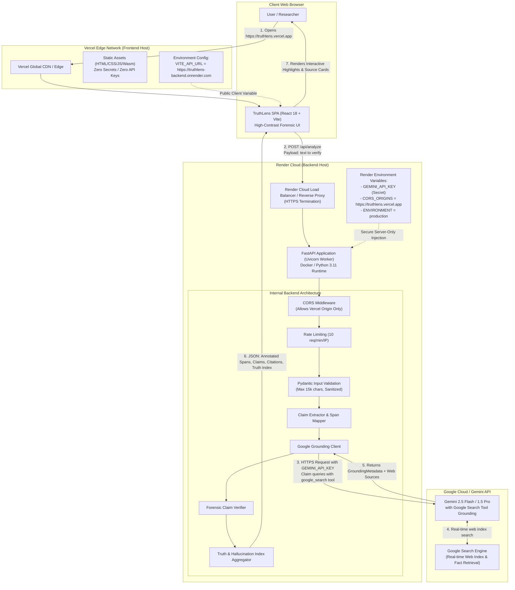
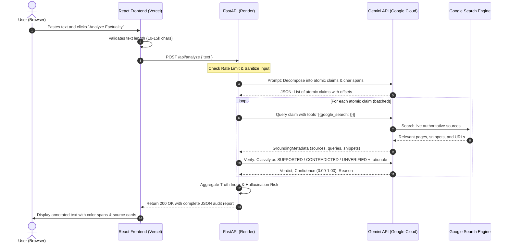

# TruthLens: Architecture Diagram & Deployment Guide (`architecture_diagram.md`)

This document provides visual architectural diagrams and an exact step-by-step procedure to deploy the FastAPI backend on **Render**, deploy the React frontend on **Vercel**, and connect them securely in production.

---

## 1. System Topology & Networking Diagram



---

## 2. Sequence Diagram: Claim Grounding Lifecycle



---

## 3. Step-by-Step Deployment Guide: Render + Vercel

Follow these exact steps to deploy both components and join them together seamlessly.

### Step 3.1: Repository Layout
Structure your project as a clean monorepo:
```
truthlens/
├── backend/
│   ├── app/
│   ├── requirements.txt
│   ├── Dockerfile
│   └── .env.example
├── frontend/
│   ├── src/
│   ├── package.json
│   ├── vite.config.ts
│   └── vercel.json
└── README.md
```

---

### Step 3.2: Deploy Backend on Render

1. **Sign in to Render**: Navigate to [dashboard.render.com](https://dashboard.render.com).
2. **Create New Web Service**:
   - Click **New +** $\rightarrow$ **Web Service**.
   - Connect your GitHub repository (`truthlens`).
3. **Configure Service Settings**:
   - **Name**: `truthlens-backend`
   - **Region**: Choose closest to your target audience (e.g., `Oregon (US West)` or `Frankfurt (EU)`).
   - **Root Directory**: `backend`
   - **Environment / Runtime**: `Python 3` (or `Docker` using the provided `Dockerfile`).
   - **Build Command**:
     ```bash
     pip install -r requirements.txt
     ```
   - **Start Command**:
     ```bash
     uvicorn app.main:app --host 0.0.0.0 --port $PORT --workers 2
     ```
   - **Plan**: Free or Starter ($7/mo).
4. **Configure Environment Variables** (in Render Dashboard $\rightarrow$ **Environment**):
   | Key | Value | Description |
   |---|---|---|
   | `GEMINI_API_KEY` | `AIzaSy...` | Your secret Google Gemini API key |
   | `CORS_ORIGINS` | `https://truthlens.vercel.app,http://localhost:5173` | Allowed frontend origins (comma-separated) |
   | `ENVIRONMENT` | `production` | Disables debug mode and Swagger in prod |
   | `RATE_LIMIT_PER_MINUTE` | `10` | Rate limit protection |
5. **Click "Create Web Service"**:
   - Render will build and deploy the application.
   - Note down your backend URL: `https://truthlens-backend.onrender.com`.
   - Test health in your browser or terminal:
     ```bash
     curl https://truthlens-backend.onrender.com/api/health
     ```

---

### Step 3.3: Deploy Frontend on Vercel

1. **Sign in to Vercel**: Navigate to [vercel.com](https://vercel.com).
2. **Add New Project**:
   - Click **Add New...** $\rightarrow$ **Project**.
   - Import your GitHub repository (`truthlens`).
3. **Configure Build & Output Settings**:
   - **Framework Preset**: `Vite`
   - **Root Directory**: Click "Edit" and select `frontend`.
   - **Build Command**: `npm run build` (or `vite build`)
   - **Output Directory**: `dist`
4. **Configure Environment Variables**:
   | Key | Value | Description |
   |---|---|---|
   | `VITE_API_URL` | `https://truthlens-backend.onrender.com` | The live Render backend URL from Step 3.2 |
5. **Configure SPA Rewrites (`vercel.json`)**:
   Ensure `frontend/vercel.json` exists with SPA routing rules:
   ```json
   {
     "rewrites": [
       { "source": "/(.*)", "destination": "/index.html" }
     ],
     "headers": [
       {
         "source": "/(.*)",
         "headers": [
           { "key": "X-Content-Type-Options", "value": "nosniff" },
           { "key": "X-Frame-Options", "value": "DENY" },
           { "key": "Referrer-Policy", "value": "strict-origin-when-cross-origin" }
         ]
       }
     ]
   }
   ```
6. **Deploy**:
   - Click **Deploy**.
   - Vercel will build and assign your production domain: `https://truthlens.vercel.app`.

---

### Step 3.4: Joining Backend & Frontend (CORS Handshake)

1. Return to the **Render Dashboard** $\rightarrow$ `truthlens-backend` $\rightarrow$ **Environment**.
2. Update `CORS_ORIGINS` to include your exact Vercel production domain:
   ```env
   CORS_ORIGINS=https://truthlens.vercel.app,https://truthlens-*.vercel.app,http://localhost:5173
   ```
3. Click **Save Changes** (Render will automatically redeploy with zero downtime).
4. Verify the end-to-end integration:
   - Visit `https://truthlens.vercel.app` in your browser.
   - Click one of the built-in preset cards (e.g. "Subtle Hallucination").
   - Click "Analyze Factuality".
   - Confirm the analysis completes and the interactive annotated report is displayed with citations.

---

### Step 3.5: Handling Render Cold Starts (Free Tier)
If using Render's free tier, backend instances spin down after 15 minutes of inactivity:
- The React frontend includes a built-in "Waking up analysis engine..." banner if the first health check takes $>3$ seconds.
- You can optionally set up a free health check cron on [cron-job.org](https://cron-job.org) pinging `https://truthlens-backend.onrender.com/api/health` every 10 minutes to keep the instance warm.
